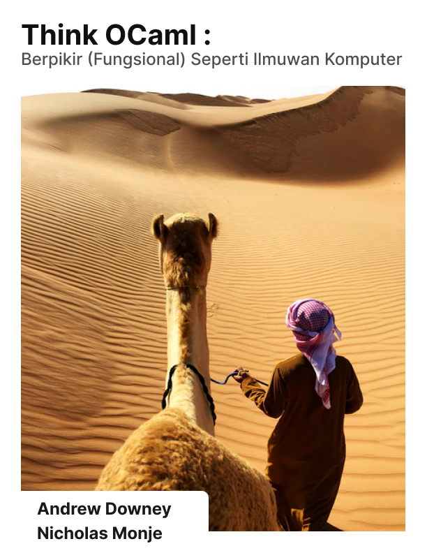

## Think OCaml: Berpikir (Fungsional) Layaknya Ilmuan Komputer

Buku ini karya dari Allen Downey dan Nicholas Monje yang diterbitkan melalui [Green Tea Press](https://greenteapress.com/thinkocaml). Kode sumber buku ini berlisensi GNU GPL versi 3 dan Isi didalamnya berlisensi Creative Commons 3.0 BY-SA.

Kredit gambar cover oleh:  [Vera Davidova](https://unsplash.com/s/photos/camel?utm_source=unsplash&utm_medium=referral&utm_content=creditCopyText) melalui Unsplash
  

### Motivasi menerjemahkan

Pandangan saya dari buku ini, menulisan penjelasan yang mudah dipahami tentang pemrograman fungsional dan saya berharap orang lain (terkhusunya orang Indonesia) membaca buku ini.